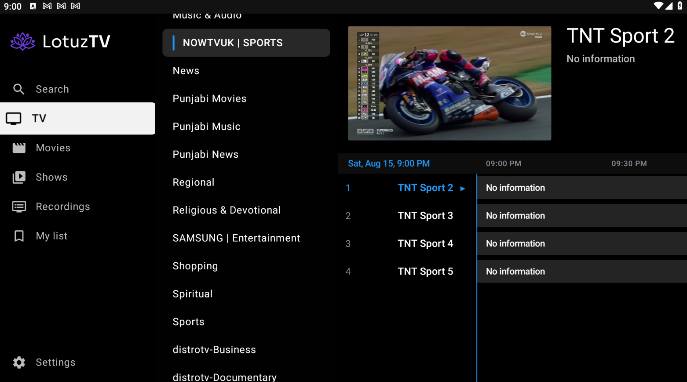
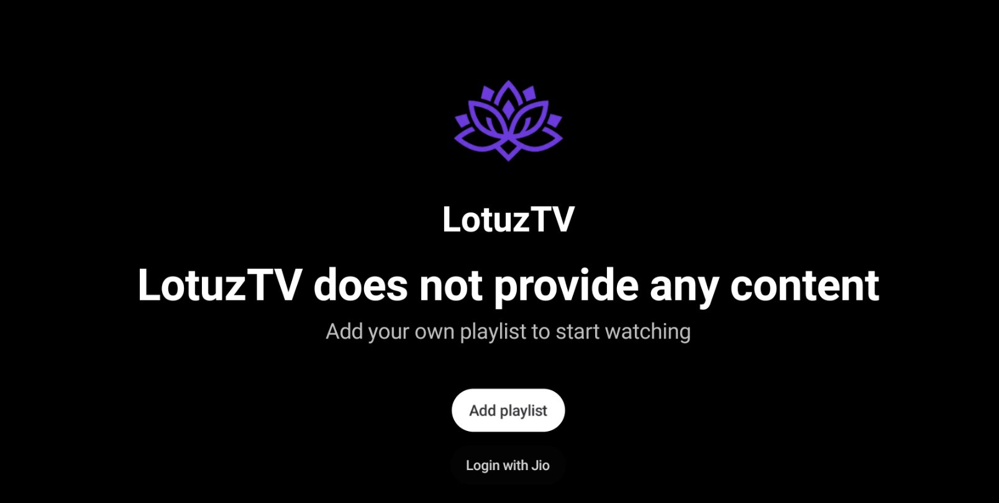
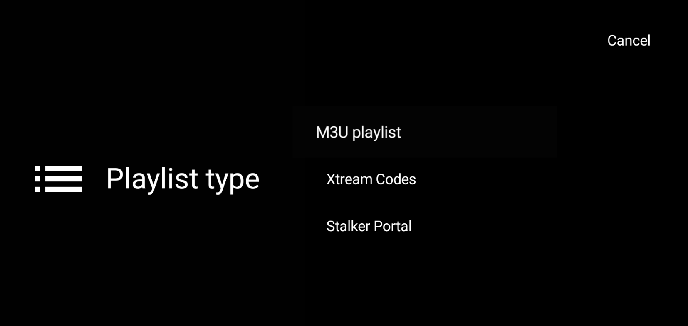
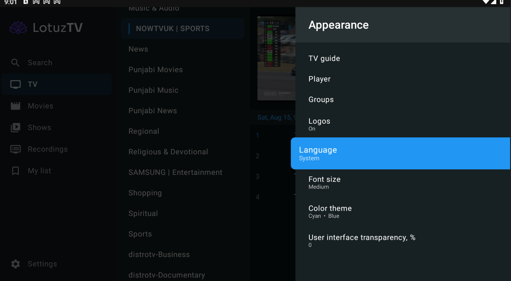

  

<h1 align="center">LotuzTV</h1>

  <strong>Fast · LotuzTV — Premium IPTV Player for Android, Android TV & Fire TV.</strong> 
  <em>Say goodbye to TiviMate and Telegram-based IPTV setups.</em>

  
  
  

> 🚧 **Coming Soon** — LotuzTV is in active private development. The public release will bring a full premium, smooth IPTV experience with 30+ interface languages.

LotuzTV is a TV-first player for the playlists, subscriptions, and accounts you already own. It does not provide channels, playlists, subscriptions, streams, or media content.

---

## 💬 Community, Bugs & Support

Follow development, ask for help, report bugs, and share feedback on the official Telegram channel:

### 👉 [Join @LotuzTV](https://t.me/LotuzTV)

Supporting the project is as simple as joining the channel, sharing LotuzTV, and ⭐ starring this repository.

---

## ✨ Features

### 📺 IPTV, Portals & JioTV

- Multiple playlist management: add, manage, and switch between IPTV playlists.
- M3U / M3U8, Xtream Codes, Stalker Portal, MAC Portal, and STB-type connections.
- Custom groups and categories; hide unwanted groups or channels; arrange channels, numbers, and favourites your way.
- Search channels and programmes quickly.
- 🇮🇳 **JioTV support:** if you are in India and do not have an IPTV playlist, log in with your own Jio number. LotuzTV shows only the channels available through your legitimate JioTV account—eligible premium channels remain tied to your subscription.

### 🗺️ EPG, Catch-up & DVR

- Full EPG / TV Guide with automatic or custom update intervals, source customisation, programme details, reminders, and direct playback from the guide.
- Past and future programme navigation, plus catch-up playback when your IPTV provider or channel supplies catch-up data.
- Manual and scheduled recording, EPG recording, and recording management.
- External/USB storage support; network or NAS storage may be used when your device and setup support it.

### ▶️ Playback & Multi-screen

- Smooth playback and channel switching with HLS, DASH, hardware or software playback choices, external-player support, and legitimate provider DRM playback.
- Auto Frame Rate, playback controls, recent/last-channel behaviour, and continue watching while browsing.
- Multiple audio and subtitle choices when supplied by the stream.
- MultiView lets you watch multiple channels at once—ideal for sport and news.

### 🎮 Remote-first & Personal

- STB-style, TV/remote-friendly interface designed around D-pad navigation.
- Custom remote buttons, short/long-press actions, and navigation behaviour.
- 30+ interface languages, plus a device **System language** option.
- Themes, fonts, backgrounds, channel/group layouts, panel and EPG transparency, panel timeout, and other TV-interface customisation.
- Parental controls with PIN protection and the ability to lock channels/groups or hide restricted content.

---

## 📸 Screenshots

  

<table>
  <tr>
    <td width="50%" valign="top">
      
      
Add your own playlist or use the Jio sign-in flow.

    </td>
    <td width="50%" valign="top">
      
      
Choose M3U, Xtream Codes, or Stalker Portal.

    </td>
  </tr>
  <tr>
    <td colspan="2" valign="top">
      
      
Appearance and system-language settings.

    </td>
  </tr>
</table>

---

## 📥 Release & Installation

LotuzTV is not publicly available yet. Official release and installation details will appear only in this repository and on [@LotuzTV](https://t.me/LotuzTV). Never install APKs from unverified sources.

## ⚙️ First-time Setup

1. Open **Add playlist**.
2. Select **M3U playlist**, **Xtream Codes**, **Stalker Portal**, or **MAC Portal**.
3. Enter details supplied by your legitimate provider or subscription.
4. Alternatively, choose **Login with Jio** and authenticate with your own Jio number.

Never share playlist URLs, usernames, passwords, OTPs, cookies, access tokens, or other credentials in screenshots, bug reports, or messages.

---

## 🛠️ Tech at a Glance

- Kotlin and Gradle
- AndroidX Media3 / ExoPlayer with HLS and DASH playback
- AndroidX, Material Components, and Kotlin Coroutines
- OkHttp networking

---

## 🗺️ Roadmap

- [ ] Publish the first signed LotuzTV release
- [ ] Release download and install guidance
- [ ] Continuous TV, remote, playback, and accessibility improvements
- [ ] Ongoing language and interface refinements

---

## 🔒 Closed-Source Project

LotuzTV is a closed-source app in private development. This public repository is for product information, screenshots, release updates, and community support; source builds and code contributions are not available.

## 🔐 Privacy & Security

- Keep provider credentials, Jio OTPs, and account sessions private.
- Use only accounts and subscriptions you are authorised to use.
- Review every playlist or portal before adding it, especially URLs containing headers, query parameters, or tokens.

## ⚖️ Legal Disclaimer

LotuzTV is a media player only. It does not host, provide, sell, or distribute any channels, playlists, subscriptions, streams, or media content. You are solely responsible for the IPTV subscriptions, playlists, portals, and accounts you use.

Do not use LotuzTV to bypass subscriptions, DRM, authentication, or other access controls. JioTV access remains subject to your own eligible Jio account and subscription. LotuzTV is not affiliated with, endorsed by, or officially connected to Jio or JioTV unless explicitly stated.

## ⭐ Support LotuzTV

For updates, bugs, questions, and support, contact the community on [@LotuzTV](https://t.me/LotuzTV). If you like the project, please ⭐ **star this repository** and share it with people who use legitimate IPTV services.
